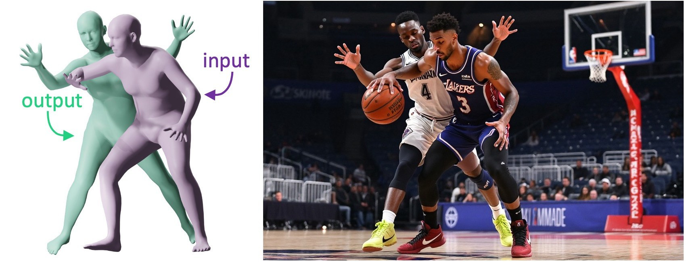

<h1 align="center">GNOCHI</h1>

<p align="center">
  <b>Generative Neural mOdel for Close Human-Human Interactions</b>
</p>

<p align="center">
  <a href="https://gonzalogn.com/">Gonzalo G&oacute;mez-Nogales</a><sup>*&nbsp;1</sup>,
  <a href="https://marccomino.github.io/">Marc Comino-Trinidad</a><sup>*&nbsp;1</sup>,
  <a href="https://orcid.org/0000-0003-0021-3930">Andr&eacute;s Casado-Elvira</a><sup>1</sup>,
  <a href="https://dancasas.github.io/">Dan Casas</a><sup>&dagger;&nbsp;1</sup>
</p>

<p align="center">
  <sup>1</sup>Universidad Rey Juan Carlos, Madrid, Spain
</p>

<p align="center">
  <sup>*</sup>Equal contribution &nbsp;&middot;&nbsp; <sup>&dagger;</sup>Work done prior to joining Amazon
</p>

<h2 align="center">
  <sup>SCA 2026 &middot; Computer Graphics Forum</b>
</h2>

<p align="center">
  <a href="#">
    
  </a>
  <a href="https://gonzalogn.com/gnochi/">
    
  </a>
  
</p>

<p align="center">
  
</p>

<p align="justify">
  GNOCHI is a generative model for close 3D human-human interactions. Given one posed SMPL avatar as a conditioning body, the model samples plausible reacting poses for a second avatar. The release model uses a conditional variational autoencoder (cVAE) to generate diverse interaction candidates and an optional CapFix refinement module to reduce inter-body collisions while preserving plausible body poses.
</p>

Important notes:

- one conditioning avatar pose is required
- bundled examples are included for quick testing
- `cvae.torch` is required
- `capfix.torch` is optional but enabled by default
- SMPL assets are optional and only required for OBJ mesh export

## Installation

```bash
git clone https://github.com/GonzaloGNogales/gnochi.git
cd gnochi

conda create -n gnochi python=3.10
conda activate gnochi

# Install CUDA-enabled PyTorch first, then the remaining GNOCHI dependencies.
python -m pip install torch --index-url https://download.pytorch.org/whl/cu128
python -m pip install -r requirements.txt
```

This is the recommended NVIDIA GPU setup. The command above uses the official PyTorch CUDA 12.8 wheels. If your GPU driver does not support CUDA 12.8, use the official PyTorch install selector at <https://pytorch.org/get-started/locally/> and replace the PyTorch install command with the CUDA version recommended for your machine.

If you do not have an NVIDIA GPU, install the CPU-only environment instead:

```bash
conda create -n gnochi python=3.10
conda activate gnochi
python -m pip install -r requirements.txt
```

If you prefer a local virtual environment:

```bash
python -m venv .venv
.venv\Scripts\activate
python -m pip install torch --index-url https://download.pytorch.org/whl/cu128
python -m pip install -r requirements.txt
```

No extra install step is needed after installing the requirements. If you run from the release root, `python -m gnochi.infer ...` works directly.

## Weights

The release expects the GNOCHI weights under:

```text
assets/weights/
```

Expected files:

```text
assets/weights/cvae.torch
assets/weights/capfix.torch
```

`cvae.torch` is the conditional generative model. `capfix.torch` is the optional collision-aware pose refinement module. The default inference command loads both.

To run without CapFix:

```bash
python -m gnochi.infer --input examples/ood_hiphop_frame000002.json --no-capfix
```

## SMPL Assets

SMPL body model files are not included in this release because they are distributed under a separate license.

To export OBJ meshes, place your SMPL files under:

```text
assets/smpl/
```

Expected examples:

```text
assets/smpl/SMPL_NEUTRAL.pkl
assets/smpl/SMPL_MALE.pkl
assets/smpl/SMPL_FEMALE.pkl
```

Without SMPL assets, inference still runs and exports JSON pose and scene files. With SMPL assets, the same command also exports OBJ meshes for visualization.

You can also point to another SMPL folder:

```bash
python -m gnochi.infer --input examples/ood_hiphop_frame000002.json --smpl-model-path /path/to/smpl
```

## Inputs

GNOCHI takes one conditioning avatar pose and generates one or more reacting avatar poses.

The release supports two input formats:

- simulator-style JSON files with `numAvatar`, `transforms`, `poses`, and `betas`
- compact single-subject JSON files with `betas`, `global_orient`, `transl`, and `body_pose`

The compact format is:

```json
{
  "betas": [0, 0, 0, 0, 0, 0, 0, 0, 0, 0],
  "global_orient": [0, 0, 0],
  "transl": [0, 0, 0],
  "body_pose": [0, 0, 0, "... 69 total values ..."]
}
```

For simulator-style files with multiple avatars, select the conditioning avatar with:

```bash
--condition-subject 0
```

The generated reacting avatar is expressed in the local coordinate frame of the conditioning avatar.

## Examples

The folder:

```text
examples/
```

contains 10 small conditioning poses so the model can be tested immediately:

- 5 in-distribution interaction examples, prefixed with `id_`
- 5 out-of-distribution Mixamo motion examples, prefixed with `ood_`

## Run Inference

Run one bundled example on CPU:

```bash
python -m gnochi.infer --input examples/ood_hiphop_frame000002.json --num-generations 10 --device cpu --skip-meshes
```

Run one bundled example on GPU, if your PyTorch installation supports CUDA:

```bash
python -m gnochi.infer --input examples/ood_hiphop_frame000002.json --num-generations 10 --device cuda
```

Run all bundled examples:

```bash
python -m gnochi.infer --input-dir examples --num-generations 10 --output-dir outputs/examples --device cpu --skip-meshes
```

Skip mesh export even if SMPL assets are available:

```bash
python -m gnochi.infer --input examples/ood_hiphop_frame000002.json --skip-meshes
```

Change the latent seed:

```bash
python -m gnochi.infer --input examples/ood_hiphop_frame000002.json --seed 1234
```

## Outputs

Outputs are written under:

```text
outputs/inference/
```

Each sample folder contains:

- `condition_subject.json`: normalized conditioning SMPL parameters
- `generated_subject_000.json`: generated reacting SMPL parameters
- `generated_scene_000.json`: two-avatar scene with condition and generated body
- `metadata_000.json`: latent vector and CapFix metadata
- `sample_summary.json`: per-input output manifest
- optional `.obj` meshes if SMPL assets are available

The top-level `summary.json` stores the run configuration, weights, seed, and generated sample list.

## License

The GNOCHI codebase and any released model weights are published under the Creative Commons Attribution-NonCommercial-NoDerivatives 4.0 International license (CC-BY-NC-ND-4.0).

You are free to share the released code and weights for non-commercial purposes, provided that appropriate credit is given to the authors and the GNOCHI paper is cited. You may not share adapted material.

Third-party assets, including SMPL body model files, are subject to their own licenses and are not redistributed here.

## Citation

If you use this work in academic research, please cite:

```bibtex
@article{gomeznogales2026gnochi,
  title   = {GNOCHI: Generative Neural mOdel for Close Human-Human Interactions},
  author  = {Gomez-Nogales, Gonzalo and Comino-Trinidad, Marc and Casado-Elvira, Andres and Casas, Dan},
  journal = {Computer Graphics Forum},
  volume  = {45},
  number  = {8},
  year    = {2026}
}
```

## Contact

For questions or collaborations, please contact:

- **Name:** Gonzalo Gomez-Nogales
- **Email:** [gonzalo.gomez@urjc.es](mailto:gonzalo.gomez@urjc.es)

- **Name:** Marc Comino-Trinidad
- **Email:** [marc.comino@urjc.es](mailto:marc.comino@urjc.es)
